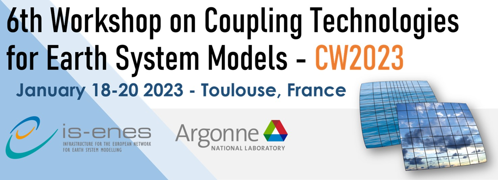

---
# change Empty Template and empty-template below
layout: page
title: 
# uncomment these if needed
# subheadline: Empty Template
# teaser: "Empty Template."
header:
   image_fullwidth: "header_homepage_13.jpg"
permalink: "/cw2023-toulouse/"
categories:
    - design
tags:
    - design
    - background color
    - header
#header:
    #background-color: "#186F4D"
header:
    title: 
    background-color: "#186F4D;"
    # uncomment if needed
    # caption: This is a caption for the header image with link
    # caption_url: https://unsplash.com/
    image_fullwidth: "banniere_workshops.jpg"

---

### Sixth Workshop on Coupling Technologies for Earth System Models (CW2023)

The 6th Workshop on Coupling Technologies for Earth System Models (CW2023) will be held on **January 18-20, 2023** at the “Centre International de Conférences” on Météo-France campus in Toulouse, France. The workshop will be held in a **hybrid format with remote attendance possible**.

The workshop aims to bring together leading researchers and practitioners in the field of coupling infrastructure for Earth System Models. This workshop is the sixth in the series, started in 2010 in Toulouse and followed by Boulder USA (2013), Manchester UK (2015), Princeton USA (2017) and virtual (2020).

Topics relevant to the workshop include, but are not limited to:
- Coupling technology latest developments
- Use of Coupling Technologies in ESMs or other climate and weather-related coupled systems: successes and failures, original or ground-breaking applications
- Computational performance of Couplers and Coupled Systems
- Coupling at exascale on heterogeneous systems.
- Science of Coupling and Coupling Strategies
- Integration of coupling technologies into workflows
- Interaction of data assimilation and coupling technologies
- Software development processes for complex coupled systems: Approaches for testing of complex coupled models, how code chages are made, build system, configuration system.

**You can find the detailed agenda [here](https://raw.githubusercontent.com/IS-ENES3/IS-ENES-Portal-Website/master/pdf_documents/CW2023-agenda-4.pdf).**

**To register, please fill [this form](https://cerfacs.fr/cw2023/).** The deadline for
submitting an abstract has passed. In-person registration will remain open until the venue is full. Remote attendance is also possible.

There is no conference hotel and no hotel at the venue.  Public transportation to the venue is available.

- [List of hotels in Toulouse](https://raw.githubusercontent.com/IS-ENES3/IS-ENES-Portal-Website/master/pdf_documents/List_of_hotels_in_Toulouse.pdf)
- [Access map to the venue](https://raw.githubusercontent.com/IS-ENES3/IS-ENES-Portal-Website/master/pdf_documents/Access_Plan_CIC.pdf)

The workshop will start onsite on January 18th with a welcome coffee at 2:00pm CET, and the talks will start at 2:30pm CET.
- Wed. 18th: 2:30pm-6:00pm CET 
- Thursday 19th: 10:00am-5:00pm CET 
- Friday 20th: 11:00am-1:00pm CET

**The CW2023 Program Committee** *(<cw_org@cerfacs.fr>)*
- Anthony Craig, Software Consultant
- Rocky Dunlap, National Center for Atmospheric Research
- Steve Easterbrook, University of Toronto
- Robert Jacob, Argonne National Laboratory
- Bert Jagers, Deltares
- Li Liu, Tsinghua University
- Kristian Mogensen, ECMWF
- Jean-Christophe Rioual, UK Met Office
- Sophie Valcke, Cerfacs
- Mariana Vertenstein, National Center for Atmospheric Research 
- Niki Zadeh, Geophysical Fluid Dynamics Laboratory

This workshop is funded by the EU H2020 IS-ENES3 project and co-organised with the [Argonne National Laboratory](https://www.anl.gov/).
